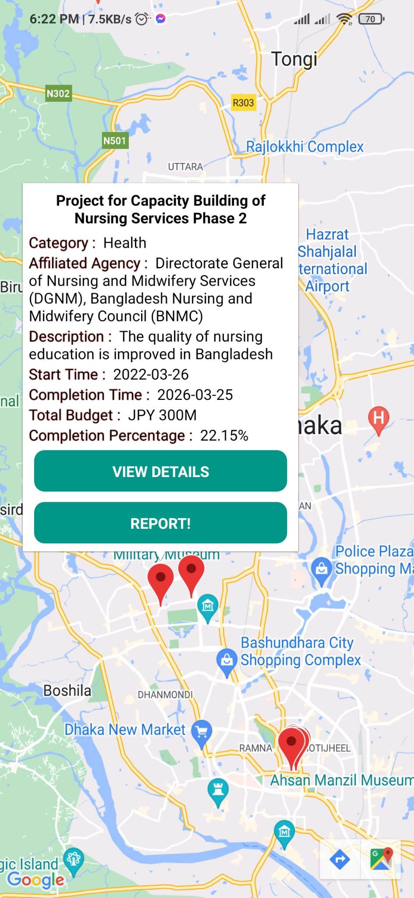

# Preliminary-Problem-for-Code-Samurai-2022

## Prerequisite
node version : `14.21.1`

## Installation
```
npm install
```

## Run Server 
```
npx expo start
```

## Features under development
- visualize the data on a map. 
- see the project offices on a map, 
- click on them to view project information details, 
- be able to post issues or concerns regarding the project. 
- The users should be capable of viewing projects by filtering them by category and project time window. 
- able to show additional visualization on the percentage of time remaining against the time of completion.
- the admin users of your developed app should be capable of visualizing and filtering the projects by the title, agencies, etc, and sorting them according to the number of issues.


## Screenshot

